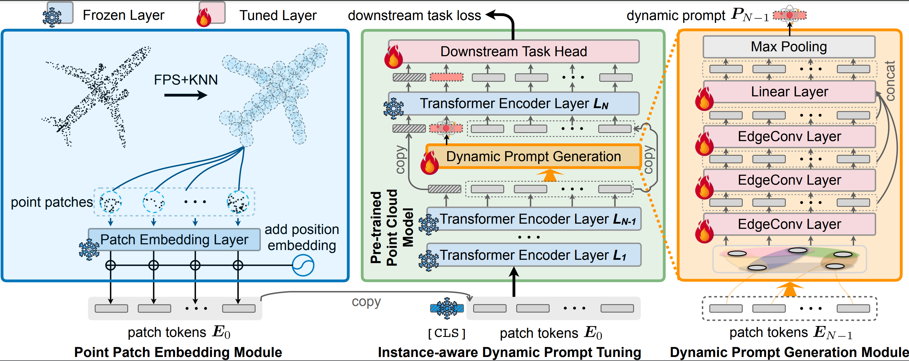

# IDPT: Instance-aware Dynamic Prompt Tuning for Pre-trained Point Cloud Models.


Official implementation of [**Instance-aware Dynamic Prompt Tuning for Pre-trained Point Cloud Models**](https://arxiv.org/abs/2304.07221).

🎉 Our paper IDPT has been accepted by **ICCV 2023** 🎉.


## 0. Introduction




We first explored prompt tuning in pre-trained point cloud models and propose an Instance-aware Dynamic Prompt Tuning (IDPT) for pre-trained point cloud models for the issue of data distribution diversity of real point cloud, which utilizes a prompt module to perceive the semantic prior features of each instance. This semantic prior facilitates the learning of unique prompts for each instance, thus enabling downstream tasks to robustly adapt to pre-trained point cloud models. Notably, extensive experiments conducted on downstream tasks demonstrate that IDPT outperforms full fine-tuning in most tasks with a mere 7% of the trainable parameters, thus significantly reducing the storage pressure.
## 1. Checkpoints

| Task              | Dataset           | Trainable Parameters  | log                                                                                                                   | Acc.       | Checkpoints Download                                                                                     |
|-------------------|-------------------|-----------------------|-----------------------------------------------------------------------------------------------------------------------|------------|----------------------------------------------------------------------------------------------------------|
| Pre-training      | ShapeNet          | 1.7M                  | -                                                                                                                     | N.A.       | [Point-MAE](https://drive.google.com/file/d/13YGle0dkvmOZyIomqWiTkXgELawklOXB/view?usp=drive_link)           |
| Classification    | ScanObjectNN      | 1.7M                  | [finetune_scan_objbg.log](https://drive.google.com/file/d/1bNe_bdyBJS-bBX5NsfOrqCmntOGJyyS-/view?usp=drive_link)      | 93.63%     | [OBJ_BG](https://drive.google.com/file/d/1usGRdpvvco068-Q1yhJoEK6mhvDDyXYo/view?usp=drive_link)          |
| Classification    | ScanObjectNN      | 1.7M                  | [finetune_scan_objonly.log](https://drive.google.com/file/d/1a4tdSXeRywEajhbdkAyreo9P24hV8Z7H/view?usp=drive_link)    | 93.12%     | [OBJ_ONLY](https://drive.google.com/file/d/1gUUtlIcfjo_nzj4sRY_z5_Pbj3R_VkKR/view?usp=drive_link)        |
| Classification    | ScanObjectNN      | 1.7M                  | [finetune_scan_hardest.log](https://drive.google.com/file/d/18P4S6WNEXRtFoi1455TD0ggex3fQL5aJ/view?usp=drive_link)    | 88.51%     | [OBJ_ONLY](https://drive.google.com/file/d/1c1wVlpSP7jRvAF0OhPxWZg3BnXz2wmia/view?usp=drive_link)        |
| Classification    | ModelNet40        | 1.7M                  | [finetune_modelnet.log](https://drive.google.com/file/d/1QsgZwlRfvfZVZRD17WeK4z5aHDsYH4V-/view?usp=drive_link)        | 93.3%      | [ModelNet_1k](https://drive.google.com/file/d/1rM1_1PrBcS4BwAn4tFWskM9Qsi4O1ioy/view?usp=drive_link)     |
| Classification    | ModelNet40 (vote) | -                     | [finetune_modelnet_vote.log](https://drive.google.com/file/d/1V_IJHb-41-ukaDRMfH2HiQhv-JxoU0dv/view?usp=drive_link)   | 94.4%      | -                                                                                                        |

| Task              | Dataset    | log                                   | 5w10s (%)  | 5w20s (%)  | 10w10s (%) | 10w20s (%) | 
|-------------------|------------|------------------------------------------|------------|------------|------------|------------|
| Few-shot learning | ModelNet40 | [fewshot_logs](https://drive.google.com/drive/folders/19WXJtFBKOrFF5RZ5aosWkU4J59dRIzZD?usp=drive_link) | 97.3 ± 2.1 | 97.9 ± 1.1 | 92.8 ± 4.1 | 95.4 ± 2.9 |

For classification downstream tasks, we randomly select 5 seeds to obtain the best checkpoint.

## 2. Requirements and Datasets
### Requirements
PyTorch >= 1.7.0 < 1.11.0;
python >= 3.7;
CUDA >= 9.0;
GCC >= 4.9;
torchvision;

```
conda create -y -n idpt python=3.7
conda activate idpt
pip install torch==1.8.0+cu111 torchvision==0.9.0+cu111 torchaudio==0.8.0 -f https://download.pytorch.org/whl/torch_stable.html
pip install -r requirements.txt
# Chamfer Distance & emd
cd ./extensions/chamfer_dist
python setup.py install --user
cd ./extensions/emd
python setup.py install --user
# PointNet++
pip install "git+https://github.com/erikwijmans/Pointnet2_PyTorch.git#egg=pointnet2_ops&subdirectory=pointnet2_ops_lib"
# GPU kNN
pip install --upgrade https://github.com/unlimblue/KNN_CUDA/releases/download/0.2/KNN_CUDA-0.2-py3-none-any.whl
pip install torch-scatter
```

### Datasets

We use ShapeNet, ScanObjectNN, ModelNet40 and ShapeNetPart in this work. See [DATASET.md](./DATASET.md) for details.


## 3. Pre-training a foundation model (e.g. Point-MAE)
To pretrain Point-MAE on ShapeNet training set, run the following command. If you want to try different models or masking ratios etc., first create a new config file, and pass its path to --config.

```
CUDA_VISIBLE_DEVICES=<GPU> python main.py --config cfgs/pretrain.yaml --exp_name <output_file_name>
(CUDA_VISIBLE_DEVICES=0 python main.py --config cfgs/pretrain.yaml --exp_name pretrain_pointmae)
```

We also provide pre-trained models (Point-MAE) to get you started quickly.
## 4. Tuning on downstream tasks

### ModelNet40

VPT-Deep:
```
CUDA_VISIBLE_DEVICES=<GPUs> python main.py --config cfgs/finetune_modelnet_vpt.yaml --finetune_model --exp_name <output_file_name> --ckpts <path/to/pre-trained/model>
(CUDA_VISIBLE_DEVICES=0 python main.py --config cfgs/finetune_modelnet_vpt.yaml --ckpts ./checkpoint/pretrain/mae/ckpt-last.pth --finetune_model --exp_name modelnet_vpt)
(CUDA_VISIBLE_DEVICES=0 python main.py --config cfgs/finetune_modelnet.yaml --test --vote --exp_name modelnet_vpt_vote --ckpts ./experiments/finetune_modelnet/cfgs/modelnet_vpt/ckpt-best.pth)
```

IDPT:
```
CUDA_VISIBLE_DEVICES=<GPUs> python main.py --config cfgs/finetune_modelnet_idpt.yaml --finetune_model --exp_name <output_file_name> --ckpts <path/to/pre-trained/model>
(CUDA_VISIBLE_DEVICES=0 python main.py --config cfgs/finetune_modelnet_idpt.yaml --ckpts ./checkpoint/pretrain/mae/ckpt-last.pth --finetune_model --exp_name modelnet_idpt)
(CUDA_VISIBLE_DEVICES=0 python main.py --config cfgs/finetune_modelnet.yaml --test --vote --exp_name modelnet_idpt_vote --ckpts ./experiments/finetune_modelnet/cfgs/modelnet_idpt/ckpt-best.pth)
```


### ScanObjectNN PB_T50_RS

VPT-Deep:
```
CUDA_VISIBLE_DEVICES=<GPUs> python main.py --config cfgs/finetune_scan_hardest_vpt.yaml --finetune_model --exp_name <output_file_name> --ckpts <path/to/pre-trained/model>
(CUDA_VISIBLE_DEVICES=0 python main.py --config cfgs/finetune_scan_hardest_vpt.yaml --ckpts ./checkpoint/pretrain/mae/ckpt-last.pth --finetune_model --exp_name hard_vpt)
```

IDPT:
```
CUDA_VISIBLE_DEVICES=<GPUs> python main.py --config cfgs/finetune_scan_hardest_idpt.yaml --finetune_model --exp_name <output_file_name> --ckpts <path/to/pre-trained/model>
(CUDA_VISIBLE_DEVICES=0 python main.py --config cfgs/finetune_scan_hardest_idpt.yaml --ckpts ./checkpoint/pretrain/mae/ckpt-last.pth --finetune_model --exp_name hard_idpt)
```


### ScanObjectNN OBJ_BG


VPT-Deep:
```
CUDA_VISIBLE_DEVICES=<GPUs> python main.py --config cfgs/finetune_scan_objbg_vpt.yaml --finetune_model --exp_name <output_file_name> --ckpts <path/to/pre-trained/model>
(CUDA_VISIBLE_DEVICES=0 python main.py --config cfgs/finetune_scan_objbg_vpt.yaml --ckpts ./checkpoint/pretrain/mae/ckpt-last.pth --finetune_model --exp_name bg_vpt)
```

IDPT:
```
CUDA_VISIBLE_DEVICES=<GPUs> python main.py --config cfgs/finetune_scan_objbg_idpt.yaml --finetune_model --exp_name <output_file_name> --ckpts <path/to/pre-trained/model>
(CUDA_VISIBLE_DEVICES=0 python main.py --config cfgs/finetune_scan_objbg_idpt.yaml --ckpts ./checkpoint/pretrain/mae/ckpt-last.pth --finetune_model --exp_name bg_idpt)
```

### ScanObjectNN OBJ_ONLY

VPT-Deep:
```
CUDA_VISIBLE_DEVICES=<GPUs> python main.py --config cfgs/finetune_scan_objonly_vpt.yaml --finetune_model --exp_name <output_file_name> --ckpts <path/to/pre-trained/model>
(CUDA_VISIBLE_DEVICES=0 python main.py --config cfgs/finetune_scan_objonly_vpt.yaml --ckpts ./checkpoint/pretrain/mae/ckpt-last.pth --finetune_model --exp_name only_vpt)
```

IDPT:
```
CUDA_VISIBLE_DEVICES=<GPUs> python main.py --config cfgs/finetune_scan_objonly_idpt.yaml --finetune_model --exp_name <output_file_name> --ckpts <path/to/pre-trained/model>
(CUDA_VISIBLE_DEVICES=0 python main.py --config cfgs/finetune_scan_objonly_idpt.yaml --ckpts ./checkpoint/pretrain/mae/ckpt-last.pth --finetune_model --exp_name only_idpt)
```


### Few-shot


VPT-Deep:
```
CUDA_VISIBLE_DEVICES=<GPUs> python main.py --config cfgs/fewshot_vpt.yaml --finetune_model --ckpts <path/to/pre-trained/model> --exp_name <output_file_name> --way <5 or 10> --shot <10 or 20> --fold <0-9>
(CUDA_VISIBLE_DEVICES=0 python main.py --config cfgs/fewshot_vpt.yaml --finetune_model --ckpts ./checkpoint/pretrain/mae/ckpt-last.pth --exp_name fewshot_vpt --way 5 --shot 10 --fold 0)
```

IDPT:
```
CUDA_VISIBLE_DEVICES=<GPUs> python main.py --config cfgs/fewshot_idpt.yaml --finetune_model --ckpts <path/to/pre-trained/model> --exp_name <output_file_name> --way <5 or 10> --shot <10 or 20> --fold <0-9>
(CUDA_VISIBLE_DEVICES=3 python main.py --config cfgs/fewshot_idpt.yaml --finetune_model --ckpts ./checkpoint/pretrain/mae/ckpt-last.pth --exp_name fewshot_idpt --way 5 --shot 10 --fold 0)
```

### Part segmentation

Part segmentation on ShapeNetPart, run:
```
cd segmentation

python main.py --model prompt_pt3 --optimizer_part only_new --ckpts <path/to/pre-trained/model> --root path/to/data --learning_rate 0.0002 --epoch 300
(CUDA_VISIBLE_DEVICES=3 python main.py --model prompt_pt3 --optimizer_part only_new --ckpts ../checkpoint/pretrain/mae/ckpt-last.pth --root ../data/shapenetcore_partanno_segmentation_benchmark_v0_normal/ --log_dir seg_idpt --learning_rate 0.0002 --epoch 300)
```


## 5. Validate on our checkpoints


```
CUDA_VISIBLE_DEVICES=<GPUs> python main.py --test --config <yaml_file_name> --exp_name <output_file_name> --ckpts <path/to/ckpt>

CUDA_VISIBLE_DEVICES=0 python main.py --config cfgs/finetune_scan_hardest_idpt.yaml --ckpts ./checkpoint/hardest/ckpt-best.pth --test --exp_name hard_test
CUDA_VISIBLE_DEVICES=0 python main.py --config cfgs/finetune_scan_objbg_idpt.yaml --ckpts ./checkpoint/bg/ckpt-best.pth --test --exp_name bg_test
CUDA_VISIBLE_DEVICES=0 python main.py --config cfgs/finetune_scan_objonly_idpt.yaml --ckpts ./checkpoint/only/ckpt-best.pth --test --exp_name only_test

CUDA_VISIBLE_DEVICES=0 python main.py --config cfgs/finetune_modelnet_idpt.yaml --ckpts ./checkpoint/modelnet40/ckpt-best.pth --test --exp_name model_test
CUDA_VISIBLE_DEVICES=0 python main.py --config cfgs/finetune_modelnet_idpt.yaml --test --vote --exp_name modelnet_idpt_vote --ckpts ./checkpoint/modelnet40/ckpt-best.pth

# Validate on few-show
python parse_test_res.py ./experiments/all/fewshot --multi-exp --few-shot
```


## Acknowledgements

Our codes are built upon [Point-MAE](https://github.com/Pang-Yatian/Point-MAE), [Point-BERT](https://github.com/lulutang0608/Point-BERT), [ACT](https://github.com/RunpeiDong/ACT), [DGCNN](https://github.com/WangYueFt/dgcnn) and [VPT](https://github.com/KMnP/vpt). Thanks for their efforts.


